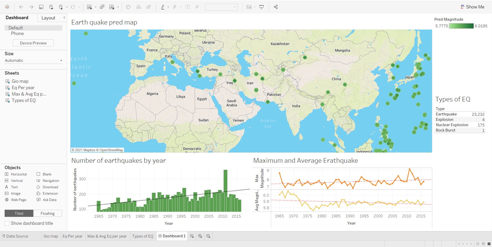

# Earthquake Prediction

This project is based on Big data and machine learning. I have used big data technology to predict the future of the earthquake. Prediction is based on the data of the past few years.

## Screen Shots of output

### Gio Map


### Earth Quake


### Max & Avg Earthquake per year


### Types of Earthquake


### Dashboard



### Technology like

1. Pyspark --> for etl(extract, transform, load)
2. Spark MLlib --> for machine learning
3. Tableau --> for reporting, visualization and dashboard
4. Mongodb --> for storing the data

## Software Requirements

1. Python 3.9
2. Jupyter Notebook
3. MongoDB
4. Apache Spark link: 🔗[Youtube](https://youtu.be/cYL42BBL3Fo)
5. Tableau

<hr>

# NOTE: PEASE DO SETUP OF APACHE SPERK in your system envs and INSTALL MongoDB ODBC Drivers [YOUTUBE](https://www.youtube.com/watch?v=ujyEgHJ2blc)

### Steps to run the project

1. Clone the code.
2. Install the python dependencies from requirements.txt.

    ```
    pip install -r requirements.txt
    ```

3. Make sure your mongodb server is running.
4. Run command given below in your command prompt or terminal.

    ```
    pyspark --conf "spark.mongodb.input.uri=mongodb://127.0.0.1/Quake.quakes?readPreference=primaryPreferred" --conf "spark.mongodb.input.uri=mongodb://127.0.0.1/Quake.quakes" --packages org.mongodb.spark:mongo-spark-connector_2.12:2.4.1
    ```

5. open jupyter notebook `earthquake_prediction.ipynb` and run the jupyter norebook cells one by one.
6. open your mongodb and you will see data in your mongoDB database.
